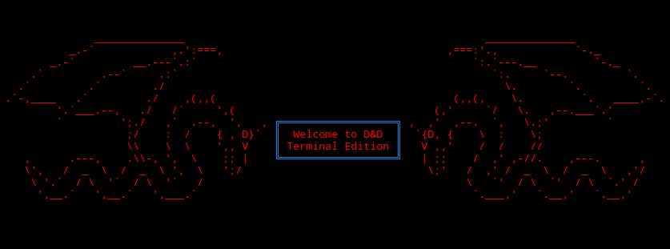
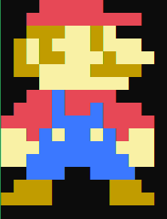

# Termgine

Game engine for terminal games writen in `C#` and `.Net Core`

Be sure to check our [Wiki](https://github.com/Morasiu/Termgine/wiki) and [Trello](https://trello.com/b/1EpbQfUH/termgine)

and let's [Get Started](https://github.com/Morasiu/Termgine/wiki/GetStarted) 👍

You can catch me on [Gitter](https://gitter.im/Termgine) too!
## Examples
* D&D Menu
  

* Mario (in color!)

  

## Authors

* Morasiu (morasiu2@gmail.com)

## License

This project is licensed under the MIT License - see the [LICENSE](LICENSE) file for details
